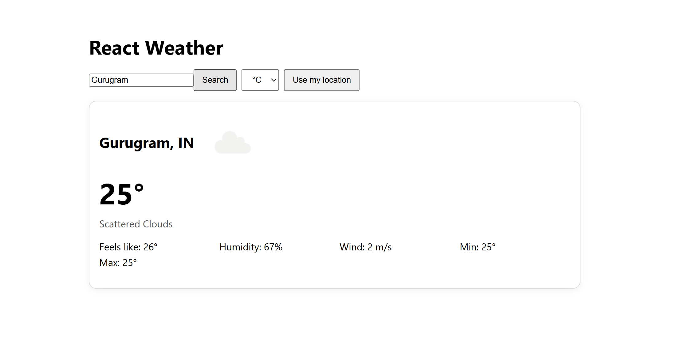

React Weather App

A weather application built with React that shows real-time weather information based on city or geolocation.

 Table of Contents
- [Project Overview](project-overview)
- [Features](features)
- [Technologies Used](technologies-used)
- [Getting Started](getting-started)
- [🧩 Learnings](-learnings)
- [👨‍💻 Developer](-developer)
- [🔧 Next Steps](-next-steps)
- [References](references)

 Project Overview
This project allows users to check current weather conditions in any city or by using their location.  

 Features
- Search weather by city
- Use browser location to get weather
- Switch between Celsius and Fahrenheit
- Responsive UI

 Technologies Used
- React.js
- CSS / Tailwind (if used)
- OpenWeather API
- Axios / Fetch API

 Getting Started
 `npm install`
Install dependencies.

 `npm start`
Runs the app in development mode.

🧩 Learnings
Through this project, I gained hands-on experience with:  
- React component architecture and reusability  
- Handling APIs and asynchronous data fetching  
- State management using React Hooks  
- Responsive web design and user experience optimization  

👨‍💻 Developer
Parth Saxena  
📍 VIT Vellore Graduate | React.js & Web Development Enthusiast  
🔗 [LinkedIn](www.linkedin.com/in/parth-saxena-a29724375)  
🔗 [GitHub](https://github.com/parthsaxena290802-lgtm)  

 References
- [React Documentation](https://reactjs.org/)  
- [OpenWeather API](https://openweathermap.org/api)  
- [Create React App Docs](https://facebook.github.io/create-react-app/docs/getting-started)
